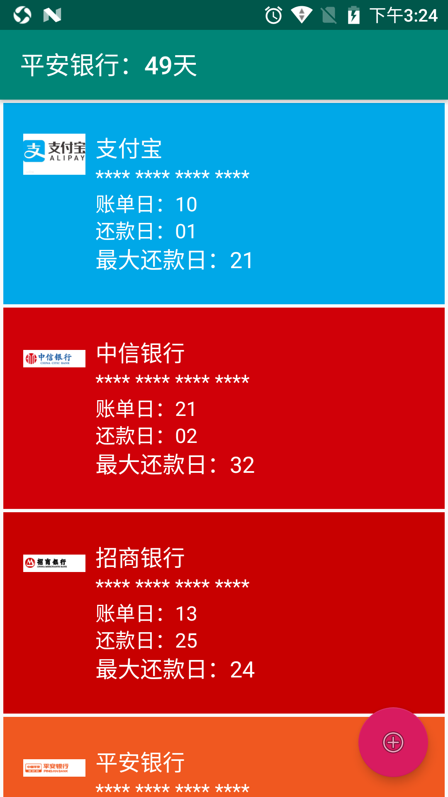
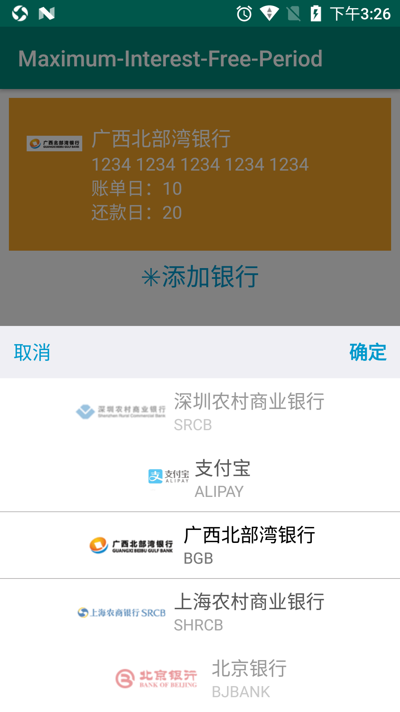

# Maximum Billing Cycle
# 最长免息期，计算工具

## 输入您所有信用卡的账单日和还款日信息，在您消费的时候，帮您计算出，消费那天免息期最长的最适宜刷的信用卡。

    专业英语：
    Bankcard 银行卡
    Creditcard 信用卡
    Account 账户
    Billing Cycle 帐单周期
    Grace Period 免息期

    Credit card payment 信用卡还款
    Statement Date 结单日期
    Previous settlement Date 上次结算日
    Booked Date 记账日期
    Due Date 到期还款日
    Next Payment Date 还款到期日
    Transaction Date 交易日
    
    
## 预期功能

- 手动添加信用卡，信用卡银行识别，图像识别。
- 各个银行查询账单
- 计算所有信用卡，当前日消费最长免息周期
- 还款提醒
- 通知栏提示今天

## 银行卡号接口

    https://blog.csdn.net/weixin_30832983/article/details/95751307?ops_request_misc=%257B%2522request%255Fid%2522%253A%2522158451488119724811832641%2522%252C%2522scm%2522%253A%252220140713.130056874..%2522%257D&request_id=158451488119724811832641&biz_id=0&utm_source=distribute.pc_search_result.none-task

    https://ccdcapi.alipay.com/validateAndCacheCardInfo.json?_input_charset=utf-8&cardNo=%E9%93%B6%E8%A1%8C%E5%8D%A1%E5%8D%A1%E5%8F%B7&cardBinCheck=true
    https://apimg.alipay.com/combo.png?d=cashier&t=CCB

## 界面
#### 主界面

#### 添加卡片界面

